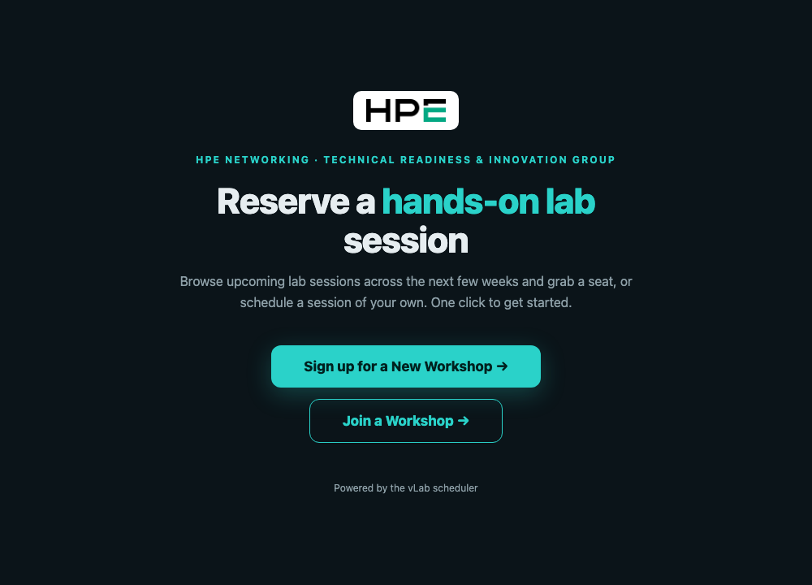
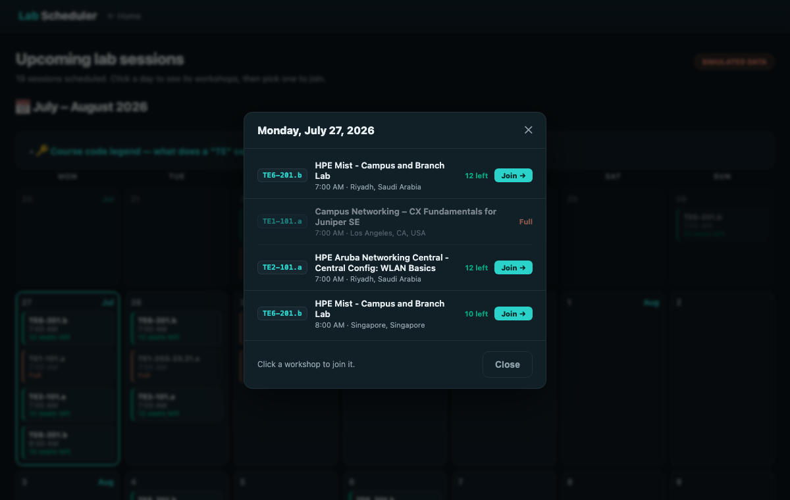
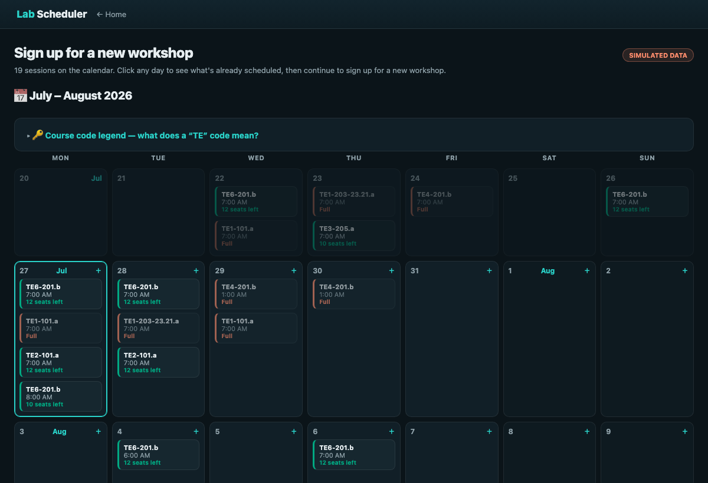

# Lab Scheduler

A lightweight, public-facing reservation portal for hands-on lab workshops. Students
browse the sessions scheduled over the coming weeks on a calendar, **join** an existing
workshop, or **sign up for a new** one — all without an account. It's a thin, friendly
front end over the vLab scheduler API.

Built by **HPE Networking · Technical Readiness & Innovation Group (TRIG)**.

---

## Screenshots

| Welcome | Day detail (Join) |
| --- | --- |
| [](docs/img/welcome.png) | [](docs/img/day-modal.png) |

The month calendar — click any day to see what's scheduled:

[](docs/img/calendar.png)

---

## Features

- **Month calendar** of upcoming lab sessions, grouped by day, with per-session seat
  counts and a course-code "decoder ring" legend.
- **Two self-service flows**, both starting from the same calendar:
  - **Join a Workshop** — click a day to see everything scheduled that day (with titles),
    then click a workshop to add yourself to it.
  - **Sign up for a New Workshop** — click a day to preview what's already booked, then
    continue to a form that schedules a new session (course + start date/time + time zone),
    with the date you picked pre-filled.
- **Day-detail modal** shared by both flows — one consistent interaction.
- **Time-zone aware** — join sessions show the zone they were scheduled in; new sessions
  let you choose. End time defaults to a fixed duration after the start.
- **Simulated mode** — with no API key configured, the portal runs against bundled sample
  data so you can demo or develop the UI offline.
- **Resilient** — a clear banner is shown if the scheduler is unreachable, rather than an
  error page.
- **Self-hosted assets** — the date picker (flatpickr) is vendored locally, so the portal
  works on networks that block third-party CDNs.

---

## How it works

```
Welcome  ─┬─►  Calendar (Join)  ─►  Day modal  ─►  pick a workshop  ─►  Join form  ─►  ✅ / ⚠️
          └─►  Calendar (New)   ─►  Day modal  ─►  Continue         ─►  New form   ─►  ✅ / ⚠️
```

The app calls three scheduler endpoints:

| Action | Method | Endpoint |
| --- | --- | --- |
| Fetch schedule | `GET`  | `/v1/items` |
| Join a session | `POST` | `/v1/reservations/{resId}/add-seat/` |
| Create a session | `POST` | `/v1/reservations/create` |

All API access is server-side (via `vlab_client.py`); the browser never talks to the
scheduler directly.

---

## Tech stack

- **FastAPI** + **Jinja2** templates
- **SQLite** for the local transaction log
- **Uvicorn** ASGI server
- **Docker** / Docker Compose
- No JavaScript build step — vanilla JS, vendored flatpickr

---

## Project layout

```
app.py                 FastAPI routes & app wiring
vlab_client.py         Scheduler API client + calendar builder
templates/             Jinja2 pages (welcome, schedule, reserve, result, …)
static/                Logo + vendored flatpickr assets
course_catalog.json    Course-code → title "decoder ring"
sample_items.json      Bundled schedule used in simulated mode
timezones.json         IANA time-zone choices for the new-workshop form
data/                  SQLite DB + encryption key (created at runtime; persisted)
Dockerfile
docker-compose.yaml
```

---

## Quick start (local)

```bash
pip install -r requirements.txt

# http (not https) locally, so allow a non-Secure cookie:
COOKIE_SECURE=false uvicorn app:app --reload --port 8088
```

Open <http://127.0.0.1:8088/>. With no API key set, it runs in **simulated mode** against
`sample_items.json` — perfect for UI work.

### With Docker

```bash
docker compose up -d --build
docker compose logs -f
```

Compose maps host port **8088 → 8000** and mounts `./data` for persistence.

---

## Configuration

All configuration is via environment variables (a `.env` file next to
`docker-compose.yaml` is the easy way in production).

| Variable | Default | Purpose |
| --- | --- | --- |
| `SECRET_KEY` | *(dev placeholder)* | Signs session cookies. **Set a long random value in production.** |
| `LABPORTAL_FERNET_KEY` | *(auto-generated)* | Fernet key for encrypting stored secrets at rest. If unset, one is generated at `FERNET_KEY_PATH`. |
| `COOKIE_SECURE` | `true` | Send cookies only over HTTPS. Set `false` for local http. |
| `ROOT_PATH` | *(empty)* | Path prefix when served under one (e.g. `/lab-scheduler`). Must match the reverse proxy. No trailing slash. |
| `SCHEDULER_API_URL` | HPE vLab items URL | Schedule fetch endpoint. |
| `SCHEDULER_CREATE_URL` | HPE vLab create URL | New-reservation endpoint. |
| `SCHEDULER_JOIN_URL` | HPE vLab add-seat URL | Join (add-seat) endpoint. |
| `SCHEDULER_API_KEY` | *(empty)* | The scheduler `X-API-Key`. **Empty = simulated mode.** |
| `DEFAULT_TZ` | `America/New_York` | Default time zone on the new-workshop form. |
| `OWN_DURATION_HOURS` | `8` | New sessions end this many hours after the chosen start. |
| `DB_PATH` | `data/labportal.db` | SQLite location. |
| `FERNET_KEY_PATH` | `data/secret.key` | Where an auto-generated Fernet key is stored. |

> Provide `SCHEDULER_API_KEY` to connect the portal to the live scheduler; leave it empty
> to run against bundled sample data.

---

## Deploying behind a reverse proxy

The portal is designed to sit behind a TLS-terminating reverse proxy.

1. **Set `ROOT_PATH`** to the path prefix the proxy uses (e.g. `ROOT_PATH=/lab-scheduler`),
   or leave it empty if served at a bare host/subdomain root. Rebuild after changing it:
   `docker compose up -d --build`.
2. **Point the proxy** at the container's mapped port and forward the prefix through.
3. **Keep `COOKIE_SECURE=true`** — the proxy terminates HTTPS.

If sign-in silently returns you to the start page with no error, suspect the
proxy/session policy before the app.

---

## Data & persistence

- `./data` holds the SQLite database (the transaction log) and, if not supplied via
  `LABPORTAL_FERNET_KEY`, the generated encryption key. **Keep this directory on
  persistent storage and include it in your backups.**
- Every booking attempt — joins and new-session creations, success or failure — is
  recorded to the transaction log for later review and CSV export.

---

## License

Internal HPE Networking / TRIG tool. All rights reserved.
